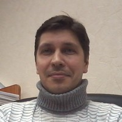

# Голубцов Евгений Игоревич

<small>
- Пол: муж.
- Дата рождения: 07.02.1979
- Проживание: Новосибирск, Россия
- сот. +7 (913) 926-73-72
- e-mail: e.golubtsoff@gmail.com
</small>

## Цель: Java-разработчик
Занятость: полная занятость     
График работы: полный день

### Ключевые навыки
Java, Git/Github, Apache Maven, Hibernate ORM, JUnit, Java Servlets, JSP, JSTL, MySQL, SQL, Apache Tomcat

### Достижения
<small> 
   
- Разработка [Web приложения "База данных резюме"](http://resumelight.herokuapp.com/) ([исходники на Github](https://github.com/golubtsoff/basejava); используемые технологии: Java 8, GitHib/Git, Сервлеты, JSP, JSTL, Tomcat, JUnit, PostgreSQL, GSON, JAXB)

- [Сертификат](http://javaops.ru/certificate?email=evigol@mail.ru) о выполнении проекта "Разработка Web приложения "База данных резюме" (javaops.ru)

- [Сертификат](https://stepik.org/certificate/ff8b591463d03e9cc0a829655d7eb031d4c1f4e9.pdf) с отличием "Java. Базовый курс" (stepik.org)

- Сертификат с отличием «Разработка веб сервиса на Java ([часть 1](https://stepik.org/certificate/ead48ddad173fc44030c8b034f72955cd3fdbc2c.pdf), [часть 2](https://stepik.org/certificate/d54e1111898e5b7d2ee2cb5e8644317a646cfed1.pdf))» (stepik.org)

- Выполнил все задания курса [Stepik Contest. Java](https://stepik.org/course/Stepik-Contest-Java-2600) (stepik.org, english)

- [Сертификат](https://stepik.org/certificate/36a2e959f9c6768abdfd3aa3c1e3a06fb10d251f.pdf) с отличием "Введение в базы данных" (stepik.org)

- [Сертификат](https://geekbrains.ru/certificates/216223.ru) «Git. Быстрый старт. Инструмент командной разработки» (geekbrains.ru)

- [Сертификат](https://certification.mail.ru/certificates/e7276088-1661-49fb-a759-03f20c22acec/) о прохождении тестирования "Java Тестирование" с результатом 80% (https://certification.mail.ru/)

- [Сертификат](https://geekbrains.ru/certificates/394389) об успешном прохождении тестирования "Java. Сложный уровень" (geekbrains.ru)

- [Сертификат](https://stepik.org/certificate/d4f26b28af68a4d4b6b31fa2f3d18aed4c632ac8.pdf) «Программирование на языке C++» (stepik.org)

- Разработка программного обеспечения для электротехнических расчётов (http://avralsoft.ru/) – Delphi/Lazarus, MS Access, MySQL, PHP

- Разработка системы ротации баннеров и ведения статистики показов в рамках разработки программного обеспечения для электротехнических расчётов (Delphi/Lazarus, PHP, MySQL)

- Веду блог о проектировании http://blog.avralsoft.ru
</small>

### Опыт работы     

*Ноябрь 2017 - Январь 2018*      
Участие в проекте [Разработка Web приложения "База данных резюме"](http://resumelight.herokuapp.com/)([исходники на Github](https://github.com/golubtsoff/basejava)):
<small>
- **Используемые технологии**: Java 8, GitHib/Git, Сервлеты, JSP, JSTL, Tomcat, JUnit, PostgreSQL, GSON, JAXB
- **Хранение резюме**:     
    - в памяти на основе массива, отсортированного массива, списка и ассоциированного массива (Map)
    - в файловой системе (File API и Java 7 NIO File API)
        - в стандартной и кастомной сериализации Java
        - в формате JSON (Google Gson)
        - в формате XML (JAXB)
    - в реляционной базе PostgreSQL
- **Деплой веб-приложения**
    - в контейнер сервлетов [Tomcat](http://tomcat.apache.org/)
    - в облачный сервис [Heroku](https://www.heroku.com/)
</small> 

*Апрель 2017 — по настоящее время*   
**ООО "Проект-Сервис"** - главный специалист (электроснабжение)

*Январь 2013 — Март 2017*       
**АО "Сибинвестпроект"** - руководитель группы (электроснабжение)
 

*Общий трудовой стаж – с 2001 г по настоящее время (проектирование систем электроснабжения).*

### Высшее образование
2001 - **Новосибирский Государственный Технический Универститет (НГТУ)**       
диплом инженера по специальности "Электроснабжение" (с отличием)

### Знание языков
Русский — родной        
Английский — читаю профессиональную литературу

*Скачать резюме в формате [pdf](contents/e.golubtsov.pdf), [docx](contents/e.golubtsov.docx)*